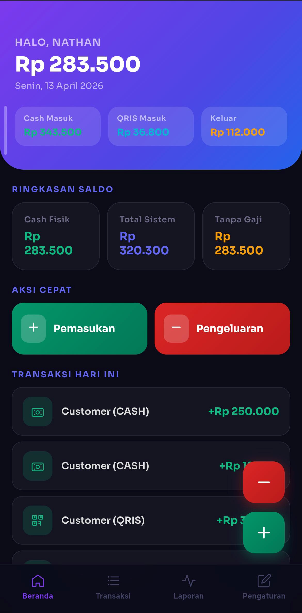
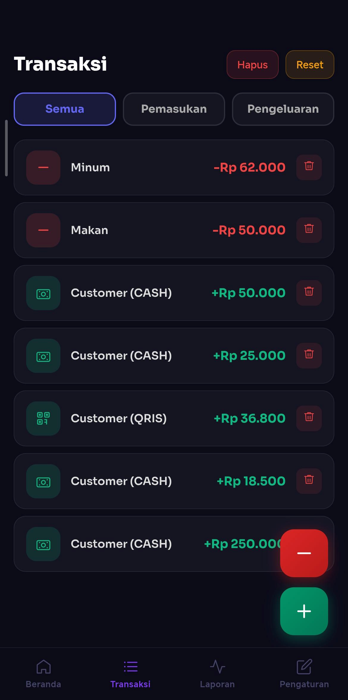
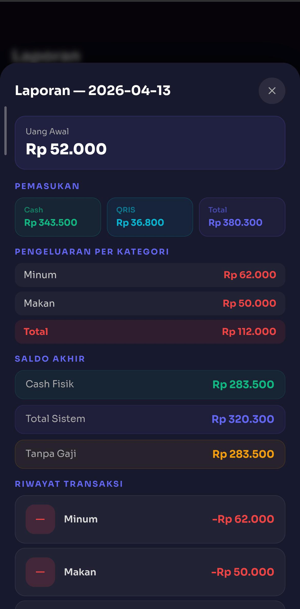

# Kas Toko

A simple multi-user cash management application designed for small shops to track daily income and expenses.

Kas Toko helps store owners record transactions, categorize expenses, and view financial reports in a simple and practical interface.

---

## Preview

## Dashboard


### Transaction


### Report


Live Demo
https://kas-app-mauve.vercel.app/

---

## Features

* Multi-user system with authentication
* Record income (Cash / QRIS)
* Expense categorization
* Daily, weekly, and monthly reports
* Secure database access using Row Level Security
* Responsive web interface
* Android build support

---

## Tech Stack

Frontend

* React
* Vite

Backend & Database

* Supabase (PostgreSQL + Auth)

Deployment

* Vercel

Mobile

* Capacitor (Android APK)

Version Control

* Git & GitHub

---

## Architecture

User
↓
React Frontend
↓
Supabase Client
↓
Supabase API
↓
PostgreSQL Database

Row Level Security (RLS) ensures each user only accesses their own data.

---

## Database Design

Example core tables:

Users
Stores basic user authentication data.

Transactions
Stores all income and expense records.

Categories
Used to classify different types of expenses.

---

## Installation

Clone repository

```
git clone https://github.com/username/kas-toko.git
```

Go to project folder

```
cd kas-toko
```

Install dependencies

```
npm install
```

Run development server

```
npm run dev
```

---

## Environment Variables

Create a `.env` file and add:

```
VITE_SUPABASE_URL=your_supabase_url
VITE_SUPABASE_ANON_KEY=your_anon_key
```

---

## Roadmap

Planned improvements:

* Data visualization (charts)
* Export transactions
* Inventory tracking
* Multi-store support

---

## Author

Nathan Liee

GitHub
https://github.com/Nathan-Liee
